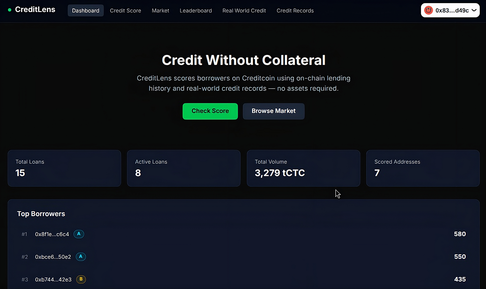
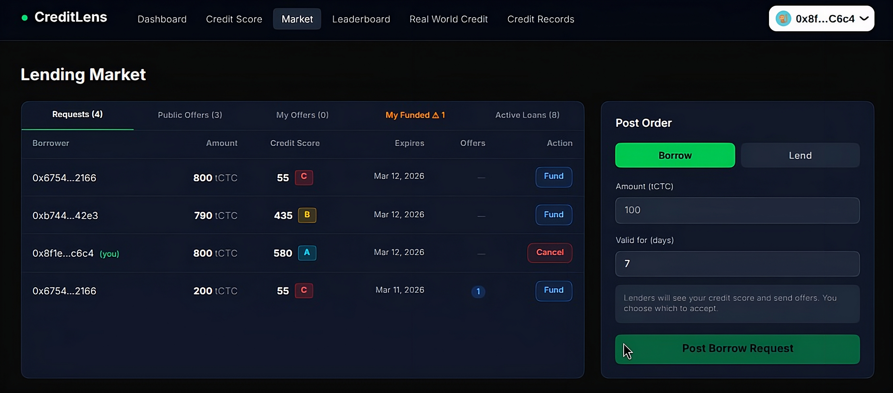
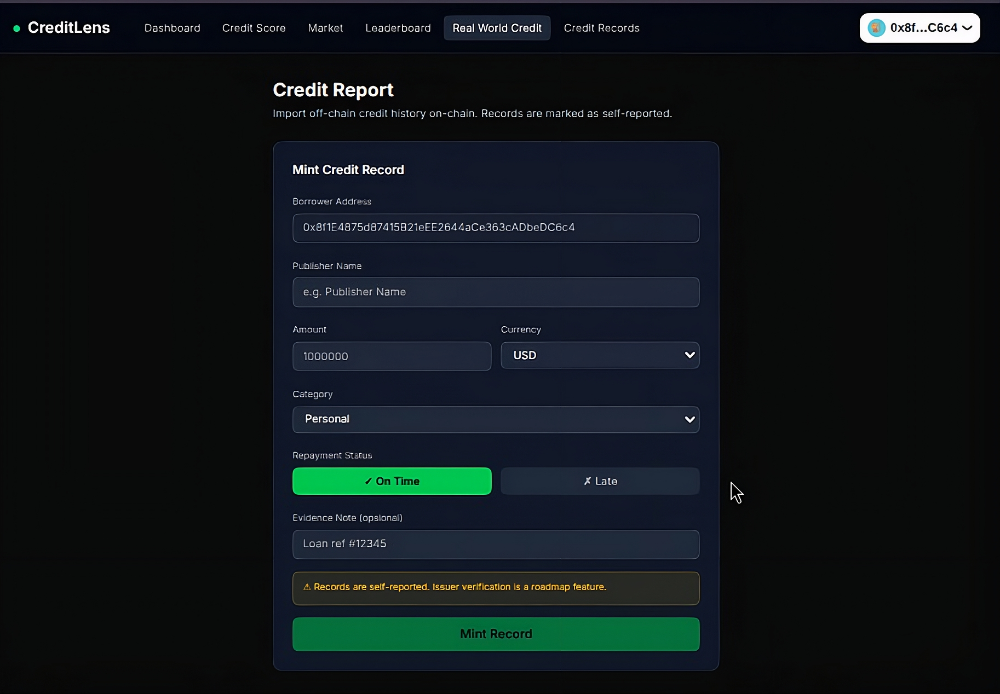
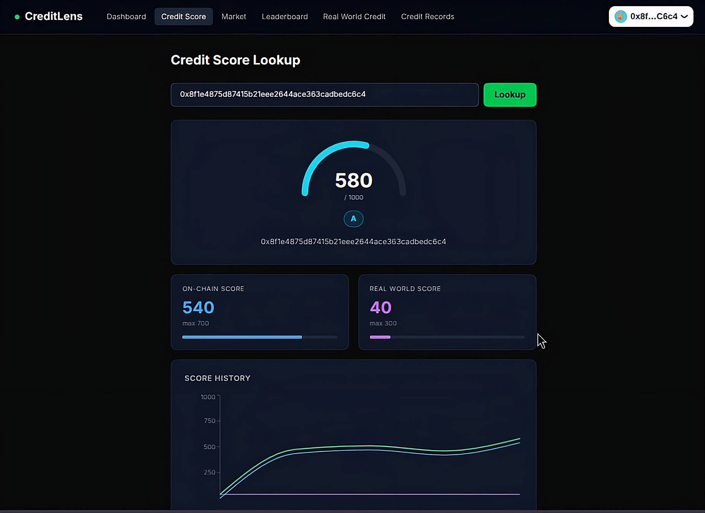
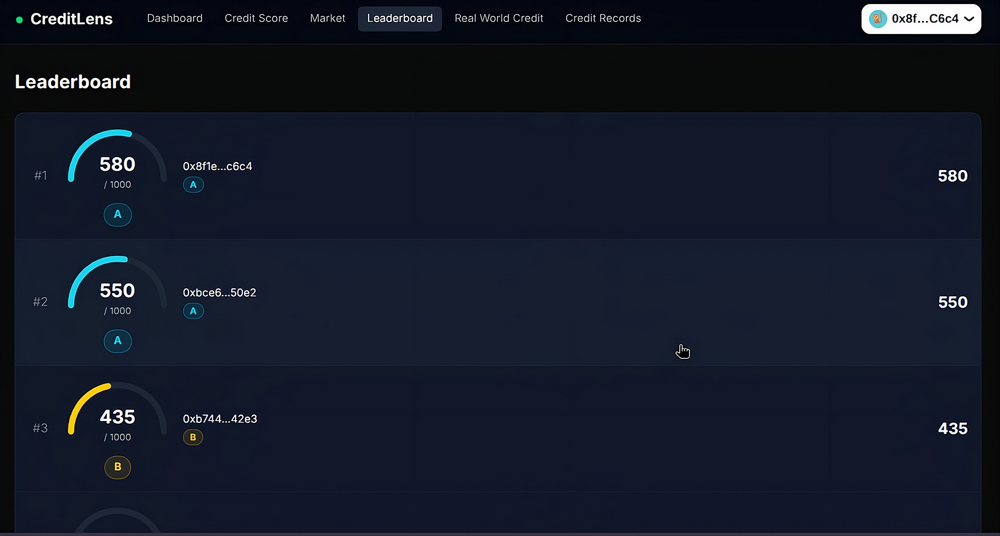
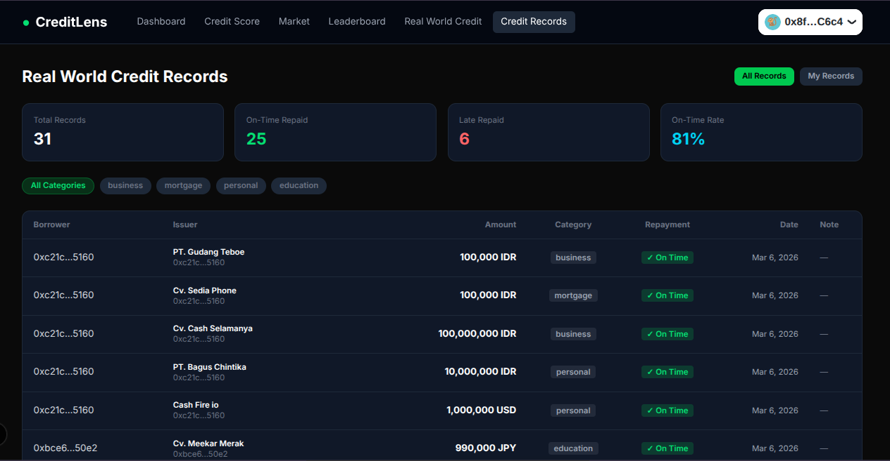

# 🔍 CreditLens

> **Credit Without Collateral** — Transparent on-chain credit scoring and uncollateralized lending on Creditcoin Testnet

Built for the **[BUIDL CTC Hackathon](https://dorahacks.io/hackathon/buidl-ctc)** on Creditcoin cc3-testnet


---

## ❗ The Problem

In traditional finance, access to credit depends on collateral — assets that most people and small businesses simply don't have. On-chain lending protocols compound this problem by requiring over-collateralization, locking up capital just to borrow less than you put in.

**Key pain points:**
- Borrowers with good repayment history have no way to prove it on-chain
- Lenders have no reliable signal to assess borrower risk without collateral
- Real-world credit records (loans, mortgages, business credit) are siloed and unverifiable on-chain
- No mechanism exists to reward honest borrowers with better loan terms over time

---

## ✅ The Solution

**CreditLens** builds a transparent, on-chain credit identity on Creditcoin by combining:

1. **On-chain loan history** — every repayment or default is recorded and scored automatically
2. **Real-world credit records** — issuers can mint verified credit records (loans, mortgages, business) on-chain
3. **A unified credit score** — composited from both sources, used as a trust signal in the lending market

Borrowers earn better scores by repaying on time. Lenders can filter borrowers by score. No collateral required.

---

## 🏗 Architecture

```
┌─────────────────────────────────────────────────────────┐
│                      CreditLens                         │
│                                                         │
│  ┌──────────────┐    ┌───────────────┐                  │
│  │ RealWorld    │    │  CreditScore  │                  │
│  │ Credit.sol   │───▶│  Oracle.sol   │                  │
│  │ (mint record)│    │  (compute     │                  │
│  └──────────────┘    │   score)      │                  │
│                      └──────┬────────┘                  │
│                             │ score                     │
│                      ┌──────▼────────┐                  │
│                      │  Lending      │                  │
│                      │  Market.sol   │                  │
│                      │               │                  │
│          ┌───────────┴───────────────┴──────────┐       │
│          │ Mechanism A  │ Mechanism B │ Mech. C  │      │
│          │ Request→Offer│ PublicOffer │  Loan    │      │
│          └─────────────┴─────────────┴──────────┘       │
│                                                         │
│  ┌──────────────────────────────────────────────────┐   │
│  │  Ponder Indexer  →  GraphQL API  →  Next.js UI   │   │
│  └──────────────────────────────────────────────────┘   │
└─────────────────────────────────────────────────────────┘
```

---

## ⚙️ How It Works

### Mechanism A — Borrower-Initiated (Request → Offer)
```
Borrower posts Request (amount, expiry)
        │
        ▼
Lenders see Request + borrower credit score
        │
        ▼
Lender funds Offer (APR, duration, expiry, amount locked)
        │
        ▼
Borrower reviews offers → Accept or Reject
        │
        ▼
Accepted → Loan created, tCTC transferred to borrower
Rejected → Lender's tCTC returned via pendingRefunds
```

### Mechanism B — Lender-Initiated (Public Offer)
```
Lender posts Public Offer (amount, APR, duration, min credit score)
        │
        ▼
Borrowers with sufficient score can Take the offer
        │
        ▼
Credit score checked on-chain at take time → Loan created
```

### Mechanism C — Loan Lifecycle
```
Active Loan
    │
    ├── Borrower repays before deadline
    │       → Loan: Repaid | Score: +points | repaidOnTime: true
    │
    └── Deadline passed, not repaid
            → Anyone calls markDefault
            → Loan: Defaulted | Score: -points
```

---

## 📊 Credit Score System

Scores range from **0 to 1000**, composed of two components:

| Component | Max | Source |
|---|---|---|
| On-Chain Score | 700 | Loan history (repaid on time, late, defaulted) |
| Real World Score | 300 | Minted real-world credit records |

### Credit Tiers

| Tier | Score Range | Access |
|---|---|---|
| AAA | 800 – 1000 | Best rates, all offers |
| AA | 650 – 799 | Excellent access |
| A | 500 – 649 | Good access |
| B | 300 – 499 | Limited offers |
| C | 0 – 299 | Restricted |

---

## ✨ Key Features

- **Uncollateralized Lending** — borrow based on credit score, not locked assets
- **Dual Credit Score** — on-chain history + real-world records combined
- **Three Lending Mechanisms** — request-based, public offer, and direct loan
- **Real World Credit Minting** — issuers can record external loan history on-chain
- **Lender Protection** — offer invalidation and pending refund system
- **Live Leaderboard** — ranked credit scores across all borrowers
- **Auto-Polling** — frontend detects refunds and loan status changes every 5s
- **Credit Records Explorer** — public view of all minted real-world records

---

## 🛠 Tech Stack

| Layer | Technology |
|---|---|
| Smart Contracts | Solidity 0.8.x, Hardhat |
| Indexer | Ponder |
| Frontend | Next.js 15.5.x, TypeScript |
| Wallet | Wagmi v2, RainbowKit |
| Styling | Tailwind CSS |
| Data | Apollo Client, GraphQL |
| Network | Creditcoin cc3-testnet |

---

## 📁 Project Structure

```text
📁 CreditLens/
├── 📁 contracts/
│   ├── 📄 LendingMarket.sol              # Core lending: requests, offers, loans
│   ├── 📄 RealWorldCredit.sol            # Mint & manage real-world credit records
│   └── 📄 CreditScoreOracle.sol          # Compute & store credit scores on-chain
├── 📁 frontend/
│   ├── 📄 .env.example                   # Frontend environment variables template
│   └── 📁 src/
│       ├── 📁 app/
│       │   ├── 📄 page.tsx               # Dashboard
│       │   ├── 📁 score/                 # Credit Score lookup
│       │   ├── 📁 market/                # Lending Market
│       │   ├── 📁 leaderboard/           # Score leaderboard
│       │   ├── 📁 rwc/                   # Mint real-world credit
│       │   └── 📁 real-world-records/    # Public credit records explorer
│       ├── 📁 components/
│       │   └── 📄 Header.tsx
│       └── 📁 lib/
│           ├── 📄 contracts.ts           # ABIs + addresses
│           └── 📄 ponder.ts              # GraphQL queries
├── 📁 ponder/
│   ├── 📄 .env.example                   # Indexer and pusher environment variables template
│   ├── 📁 abis/                          # Contract ABI files
│   ├── 📁 generated/                     # Auto-generated Ponder types
│   ├── 📁 src/
│   │   ├── 📁 api/
│   │   │   └── 📄 index.ts               # Custom API endpoints
│   │   ├── 📄 index.ts                   # Event handlers (LendingMarket + RWC)
│   │   ├── 📄 pusher.ts                  # Real-time push notifications
│   │   └── 📄 scorer.ts                  # Credit score computation logic
│   ├── 📄 ponder.config.ts               # Indexer config & contract addresses
│   └── 📄 ponder.schema.ts               # Database schema
└── 📄 README.md


---

## 🌐 Network Configuration

| Parameter | Value |
|---|---|
| Network Name | Creditcoin Testnet |
| RPC URL | `https://rpc.cc3-testnet.creditcoin.network` |
| Chain ID | `102031` |
| Currency Symbol | `tCTC` |
| Block Explorer | [creditcoin-testnet.blockscout.com](https://creditcoin-testnet.blockscout.com/) |

### Smart Contracts

| Contract | Address |
|---|---|
| LendingMarket v3 | [`0xDD98f9D3aDC99e07A473bED4E396736d13117128`](https://creditcoin-testnet.blockscout.com/address/0xDD98f9D3aDC99e07A473bED4E396736d13117128) |
| RealWorldCredit | [`0xB6A2331289F2BeB040eF29bd1932f15Ae4f3771a`](https://creditcoin-testnet.blockscout.com/address/0xB6A2331289F2BeB040eF29bd1932f15Ae4f3771a) |
| CreditScoreOracle | [`0xd908cb092578137b1642E84c830437a51428B874`](https://creditcoin-testnet.blockscout.com/address/0xd908cb092578137b1642E84c830437a51428B874) |

---

## 📸 Screenshots

### Dashboard


### Lending Market


### Real World Credit


### Credit Score


### Leaderboard


### Credit Records


---

## 🚀 Getting Started

### Prerequisites

- Node.js 18+
- npm or pnpm
- A wallet with tCTC (get from Creditcoin testnet faucet)

### 1. Clone the repo

```bash
git clone https://github.com/ajidwr4/CreditLens.git
cd CreditLens
```

### 2. Run Ponder Indexer

```bash
cd ponder
cp .env.example .env
# Fill in: PONDER_RPC_URL=https://rpc.cc3-testnet.creditcoin.network
npm install
npm run dev
# GraphQL available at http://localhost:42069
```

### 3. Run Frontend

```bash
cd frontend
cp .env.example .env.local
# Fill in: NEXT_PUBLIC_PONDER_URL=http://localhost:42069
npm install
npm run dev
# App available at http://localhost:3000
```

---

## 🗺 Roadmap

### Completed ✅
- [x] LendingMarket smart contract (3 mechanisms)
- [x] RealWorldCredit minting
- [x] CreditScoreOracle on-chain scoring
- [x] Ponder indexer with full event coverage
- [x] Frontend: Dashboard, Credit Score, Market, Leaderboard, RWC, Credit Records
- [x] Pending refund system with auto-polling
- [x] My Funded tab with invalidation flow

### Future 🔮
- [ ] **Issuer verification** — trusted issuer registry for real-world records
- [ ] **USC v2 integration** — leverage Unified Smart Contract v2 standard for cross-chain credit portability
- [ ] **Mobile app** — React Native client
- [ ] **Credit score decay** — scores decrease over inactivity periods
- [ ] **Loan insurance fund** — lender protection pool funded by protocol fees
- [ ] **Cross-chain credit** — port credit score to other EVM chains
- [ ] **Governance** — on-chain voting for score weights and protocol parameters

---

## 📄 License

This project is licensed under the **MIT License** — see the [LICENSE](./LICENSE) file for details.
